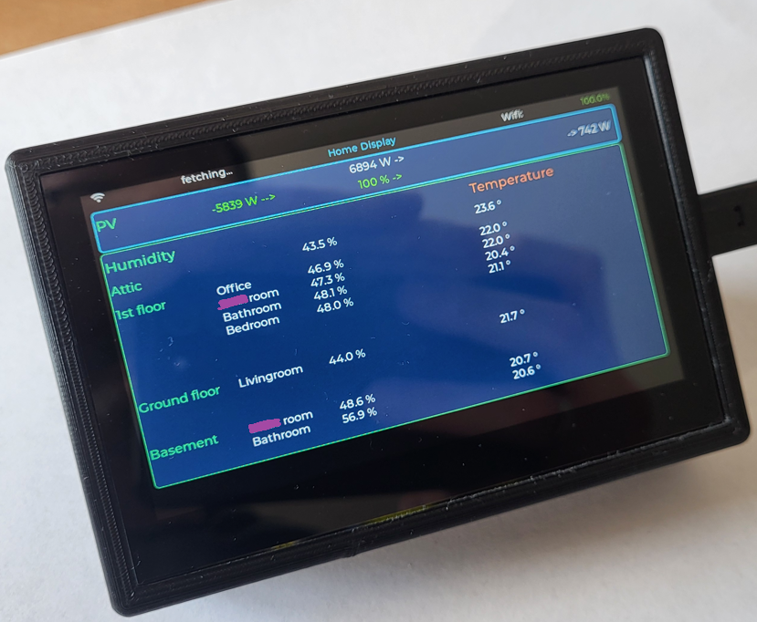
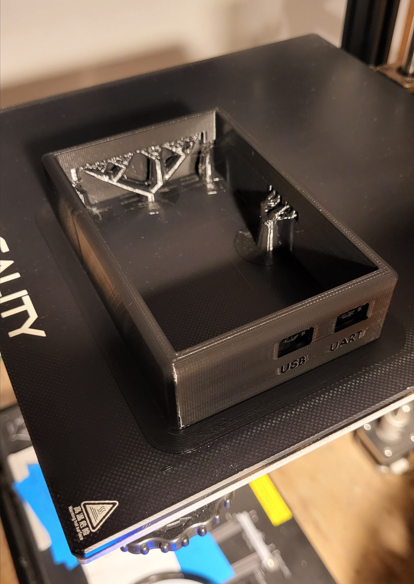
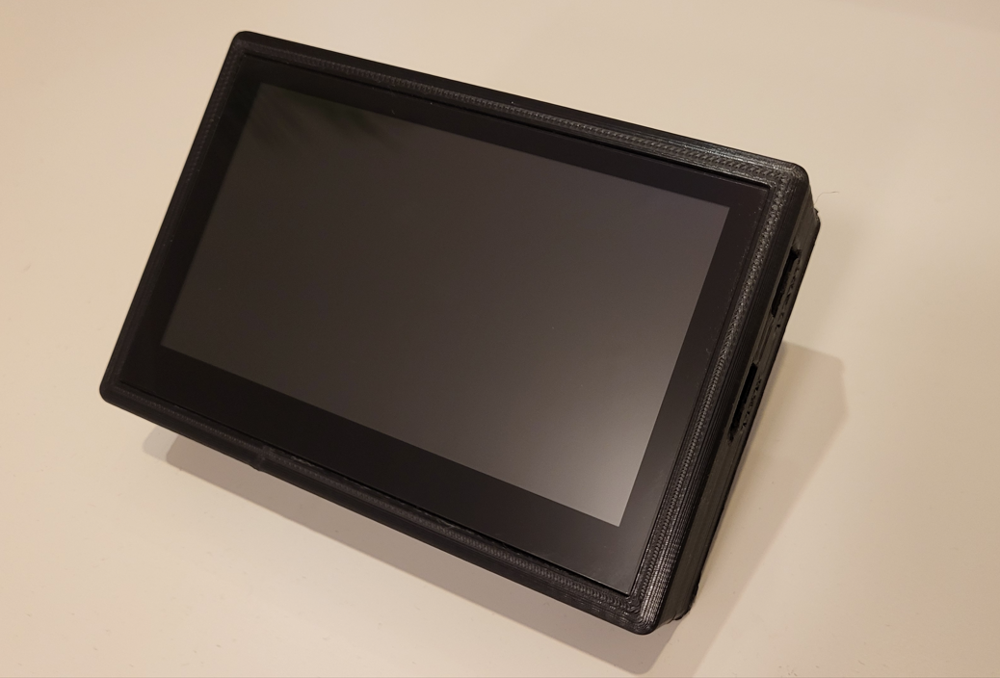
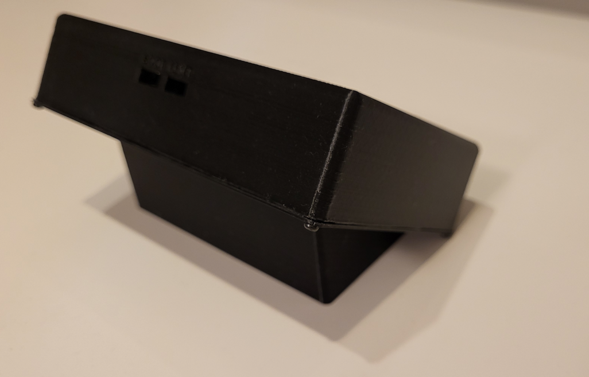

# ESP32-S3-Touch-LCD-4.3_Homeassistant

This project shows how to set up a homeassistant display that shows the most important or just any parameters of your homeassistant setup.
I started the project because I didn't want to look onto my smartphone for getting the latest HA values. A display that would turn itself to sleep but with a touch quickly wake up to show the latest value was my goal.

The image above shows the screen displaying PV status with 100% battery charged, thus exporting power. Below are humidity and temperature values. 

## Prerequisite

* A touchscreen featuring LVGL that can be flashed with ESPHome and connects to Homeassistant: 
E.g. https://de.aliexpress.com/item/1005006241981832.html?gatewayAdapt=glo2deu 
Details can be found here: https://www.waveshare.com/wiki/ESP32-S3-Touch-LCD-4.3

* A 3D print of a matching housing. As I wanted it to be sitting on a cuboard and not hung up on the wall I had to rework one that I found. But there are plenty of display mounts and housings available for that display.

* Editor to design the GUI: I used https://www.espboards.dev/tools/esphome-lvgl-designer/ to come up with a first idea and a skeleton design. 

## Setup
Add ESPHome to your Homeassistant(HA) instance and connect the display using the webbased ESPHome flash tool. Once you see the device in your HA environment tab ESPHome Builder you can change the code / skript from there using the edit function.

Copy and adjust the code from esphome-web-esp32-S3-touch-lcd-4.3.yaml and hit install to flash it via cable or even over the air / wirelessly. The compiler starts and compiles the binary to finally upload it onto the ESP32-S3 sitting on the display.

My general approach was first to get something working and then to detail it out.
I was happy first when I got HA to flash the device and ESPHome to see it. Then I made it reach out to the variables on the display itself (temperature of the device, wifi strength etc.). Then I got it to connect to the HA values and then I created a large list of temperature and humidity values from the various hygrometers placed everywhere. Additionally I added the current status of the solar system. 

Once the firmware or script was in place I 3D printed the housing and connected it to USB-C. 

## Lessions Learned
* Constantly test your script with the device! I was starting to use Copilot in VSCode but the output was misleading. In the beginning I was using pages like https://esphome.io/components/display/index.html to get the syntax right. Later, Copolit could give some hints.
* Try to optimize the "- lvgl.label.update:" calls and put all changes into one call. Otherwise the performance will be pulled down unnecessarily.
* When looking at the logs in ESPHome Builder, you can see the udpate rate of the various entities coming in. Thats valuable information to see whats going on. You can understand what your script is doing and optimize it!

